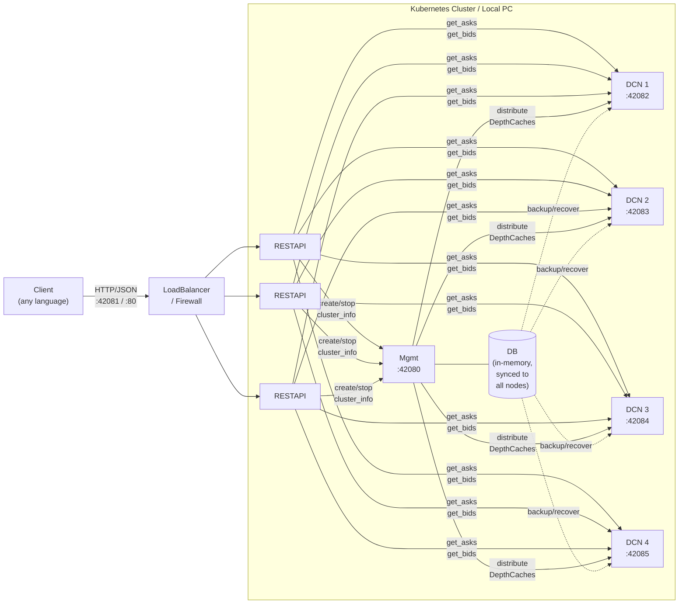

> ⚠️ Security Warning: There are currently fraudulent repositories (e.g., under the user gesine1541ro7) impersonating this project to distribute malware. Please ensure you are only using the official source: oliver-zehentleitner/unicorn-binance-websocket-api.
[Read the full technical analysis and campaign details here!](https://blog.technopathy.club/security-warning-fraudulent-github-repository-impersonating-unicorn-binance-websocket-api)

[](https://github.com/oliver-zehentleitner/unicorn-binance-depth-cache-cluster/releases)
[](https://github.com/oliver-zehentleitner/unicorn-binance-depth-cache-cluster/releases)
[](https://pypi.org/project/ubdcc-mgmt/)
[](https://pepy.tech/project/ubdcc-mgmt)
[](https://oliver-zehentleitner.github.io/unicorn-binance-depth-cache-cluster/license.html)
[](https://codecov.io/gh/oliver-zehentleitner/unicorn-binance-depth-cache-cluster)
[](https://github.com/oliver-zehentleitner/unicorn-binance-depth-cache-cluster/actions/workflows/codeql.yml)
[](https://github.com/oliver-zehentleitner/unicorn-binance-depth-cache-cluster/actions/workflows/unit-tests.yml)
[](https://github.com/oliver-zehentleitner/unicorn-binance-depth-cache-cluster/issues)
[](https://github.com/oliver-zehentleitner/unicorn-binance-depth-cache-cluster/actions/workflows/build_wheels_ubdcc.yml)
[](https://github.com/oliver-zehentleitner/unicorn-binance-depth-cache-cluster/actions/workflows/build_wheels_ubdcc_dcn.yml)
[](https://github.com/oliver-zehentleitner/unicorn-binance-depth-cache-cluster/actions/workflows/build_wheels_ubdcc_mgmt.yml)
[](https://github.com/oliver-zehentleitner/unicorn-binance-depth-cache-cluster/actions/workflows/build_wheels_ubdcc_restapi.yml)
[](https://github.com/oliver-zehentleitner/unicorn-binance-depth-cache-cluster/actions/workflows/build_wheels_ubdcc_shared_modules.yml)
[](https://github.com/oliver-zehentleitner/unicorn-binance-depth-cache-cluster/actions/workflows/docker_build.yml)
[](https://github.com/oliver-zehentleitner/unicorn-binance-depth-cache-cluster/actions/workflows/helm_release.yml)
[](https://github.com/oliver-zehentleitner/unicorn-binance-depth-cache-cluster/actions/workflows/gh_release.yml)
[](https://blog.technopathy.club/series/unicorn-binance-suite)
[](https://github.com/oliver-zehentleitner/unicorn-binance-depth-cache-cluster)
[](https://t.me/unicorndevs)

[](https://github.com/oliver-zehentleitner/unicorn-binance-suite)

# UNICORN Binance DepthCache Cluster (UBDCC)

[Why](#why) | [How it works](#how-it-works) | [Who is this for](#who-is-this-for) | [Architecture](#architecture) | [Features](#key-features) | 
[Local Setup](#local-setup-without-kubernetes) | [REST API](#rest-api) | [Kubernetes](#kubernetes-setup) | 
[API Credentials](#api-credentials) | [Python Client](#accessing-from-python) | [Bugs](#how-to-report-bugs-or-suggest-improvements) | 
[Contributing](#contributing) | [Disclaimer](#disclaimer)

**Stop dealing with broken Binance order books.**

Install one package, run one command — and every script, bot, or service on your machine gets reliable, 
synchronized order book data via REST API. Any programming language. Any number of clients.

```bash
pip install ubdcc
ubdcc start
```

Tested with 600+ redundant DepthCaches on a single machine. Scales to Kubernetes when you need more.

Part of the [UNICORN Binance Suite](https://github.com/oliver-zehentleitner/unicorn-binance-suite).

## Why

If you've built trading bots on Binance, you know the pain:

- **Restart penalty** — your script manages 100 DepthCaches. Every restart means minutes of waiting until all 
order books are re-initialized. During development, you restart constantly.
- **Duplicated connections** — three bots on the same machine, each maintaining their own WebSocket streams and 
order book copies. Triple the connections, triple the API weight, three slightly different views of the market.
- **Silent corruption** — your order book drifts out of sync and you don't notice. No error, no exception. 
You just trade on stale data until you lose money.
- **Python-only** — your depth cache lives inside a Python process. Your monitoring dashboard in Node.js, 
your execution engine in Go, your analysis tool in Rust — none of them can access it.

UBDCC solves all of this. Your DepthCaches run as a background service, independent of your scripts. 
They stay alive across restarts, serve consistent data to any language over HTTP, and never silently go stale.

## How it works

UBDCC turns Binance DepthCaches into a shared service. Instead of managing WebSocket connections and order book 
synchronization inside your trading bot, you run UBDCC once and query it over HTTP whenever you need order book data.

What's handled for you behind the scenes:

- **Guaranteed consistency** — built on [UBLDC](https://github.com/oliver-zehentleitner/unicorn-binance-local-depth-cache), 
which validates every update's sequence numbers, detects gaps, and triggers automatic resync. It also removes 
[orphaned price levels](https://blog.technopathy.club/your-binance-order-book-is-wrong-here-s-why) that Binance 
stops updating beyond the top 1000 — a gap in Binance's own specification that causes ghost entries in most 
other libraries. The cluster either serves correct data or tells you explicitly 
that it's re-syncing. It never serves stale data silently.
- **Redundancy and failover** — every DepthCache can run as multiple replicas across different nodes. If one goes 
down, the next one takes over automatically.
- **Smart rate limiting** — DepthCache initialization is throttled automatically so you never hit Binance's API 
limits. Optional per-account API credentials for higher throughput.
- **Self-healing** — cluster state is replicated to every node. If the management process restarts, it recovers 
from the latest backup automatically. No Redis, no etcd, no external database.
- **No hard limits** — more CPU cores or servers means more capacity. Scales from a laptop to a Kubernetes cluster.

Think of it as Redis for Binance order books — a shared infrastructure layer that any process can query, 
instead of every bot building its own.

### Who is this for

- **Multi-bot setups** — multiple trading bots sharing one consistent order book source instead of each 
maintaining their own
- **Arbitrage** — compare order books across markets with guaranteed consistency. No divergence between copies.
- **Market making** — reliable spread and liquidity data without silent drift
- **Rapid development** — restart your script 50 times a day without waiting for order books to re-initialize
- **Polyglot stacks** — Python bot, Node.js dashboard, Go execution engine — all reading from the same source 
via REST

It works in two ways:

- **On a single machine** — run a few processes locally and share DepthCache data between multiple bots or scripts 
on the same PC. No Kubernetes needed.
- **On a Kubernetes cluster** — scale across multiple servers with redundancy, multiple public IPs for higher Binance 
API throughput, and automatic state recovery if pods restart.

## Architecture

The system consists of three components:
- **mgmt** (1x) — manages the cluster state and distributes DepthCaches across nodes
- **restapi** (1-3x) — REST API gateway, load-balances data requests to DCN processes
- **dcn** (multiple) — runs the actual DepthCaches via UBLDC

Each DCN runs a single Python process, so **one DCN per CPU core** gives the best performance (Python's GIL limits 
each process to one core).

| Setup | Example configuration |
|-------|----------------------|
| Local (8-core PC) | 1 mgmt, 1 restapi, 6 DCN processes |
| Kubernetes (2 servers, 4 cores each) | 1 mgmt, 3 restapi, 4 DCN pods |

When you create DepthCaches (e.g. 200 markets with `desired_quantity=2`), UBDCC distributes them evenly across DCN 
processes. Each DCN downloads order book snapshots using its own network connection. Replicas are created for 
redundancy — if one DCN goes down, the other copy keeps serving data.



## Key Features

- **Deterministic order book state**: built on [UBLDC](https://github.com/oliver-zehentleitner/unicorn-binance-local-depth-cache), 
which follows Binance's synchronization model strictly — explicit out-of-sync detection, automatic resync, and 
removal of [orphaned levels](https://blog.technopathy.club/your-binance-order-book-is-wrong-here-s-why) beyond 
the guaranteed top 1000. The cluster either serves consistent data or fails 
loudly; it never silently accumulates stale levels.
- **Redundancy and automatic failover**: every DepthCache can be replicated across multiple DCN nodes 
(`desired_quantity`). The restapi load-balances queries across the replicas and falls back to the next node if one 
becomes unavailable, with the failure surfaced in the response so monitoring sees it.
- **Self-healing state**: the cluster database is replicated to every node on each sync cycle. If the management 
pod restarts, it automatically recovers the latest state from the node with the most recent backup — no external 
database (Redis, etcd) required, zero manual intervention.
- **Any language**: retrieve DepthCache data via HTTP/JSON from any programming language. Python users can use the 
[UBLDC cluster module](https://oliver-zehentleitner.github.io/unicorn-binance-local-depth-cache/unicorn_binance_local_depth_cache.html#module-unicorn_binance_local_depth_cache.cluster) 
for sync and async access.
- **Smart rate limiting**: automatically throttles DepthCache initialization when Binance API weight costs would 
otherwise blow the limits, and supports per-account API credentials so DCNs can use authenticated rate limits 
when more headroom is needed.
- **Scales with your resources**: tested with hundreds of redundant DepthCaches across multiple nodes. Add more 
servers and DCN pods to scale further — there is no hard limit.
- **Flexible filtering**: trim data at the cluster level — limit to top N Asks/Bids or filter by volume threshold. 
No need to transfer the full order book when you only need the best prices.
- **Full transparency**: every request can include `debug=true` to get detailed timing breakdowns 
(cluster execution time, transmission time, total request time), the internal routing URL, and which pods handled 
the request.
- **Fully async top to bottom**: the entire stack is built on asyncio — from the REST API down to the WebSocket 
connections. DepthCache management runs directly as a plugin inside the [UBWA](https://github.com/oliver-zehentleitner/unicorn-binance-websocket-api) 
WebSocket event loop, so order book updates are processed with zero overhead. Cluster management, data queries 
and node communication all run non-blocking, keeping response times consistent even when many clients query 
simultaneously.
- **Compiled C-Extensions**: the entire cluster runs as Cython-compiled code for maximum performance.
- **Fast access**: order book data in ~3ms (cluster-internal) or ~4ms total request time on local networks. Over 
the internet typically ~60ms.
- **Supported exchanges**:

| Exchange                                                           | Exchange string               | 
|--------------------------------------------------------------------|-------------------------------| 
| [Binance](https://www.binance.com)                                 | `binance.com`                 |
| [Binance Testnet](https://testnet.binance.vision/)                 | `binance.com-testnet`         |
| [Binance Cross Margin](https://www.binance.com)                    | `binance.com-margin`          |
| [Binance Cross Margin Testnet](https://testnet.binance.vision/)    | `binance.com-margin-testnet`  |
| [Binance Isolated Margin](https://www.binance.com)                 | `binance.com-isolated_margin` |
| [Binance Isolated Margin Testnet](https://testnet.binance.vision/) | `binance.com-isolated_margin-testnet` |
| [Binance USD-M Futures](https://www.binance.com)                   | `binance.com-futures`         |
| [Binance USD-M Futures Testnet](https://testnet.binancefuture.com) | `binance.com-futures-testnet` |
| [Binance European Options](https://www.binance.com)                | `binance.com-vanilla-options`         |
| [Binance European Options Testnet](https://testnet.binancefuture.com) | `binance.com-vanilla-options-testnet` |
| [Binance US](https://www.binance.us/)                              | `binance.us`                  |
| [Binance TR](https://www.trbinance.com)                            | `trbinance.com`               |

If you like the project, please 
[](https://github.com/oliver-zehentleitner/unicorn-binance-depth-cache-cluster/stargazers) it on 
[GitHub](https://github.com/oliver-zehentleitner/unicorn-binance-depth-cache-cluster)! 

## Local Setup (without Kubernetes)

Run UBDCC on a single machine — useful for development or when you need multiple bots to share the same 
DepthCache data without duplicate WebSocket connections.

### Install

```bash
pip install ubdcc
```

This installs all components (mgmt, restapi, dcn), the `ubdcc` cluster manager and the
[UBDCC Dashboard](https://github.com/oliver-zehentleitner/ubdcc-dashboard) (browser UI,
launched via `ubdcc-dashboard start`).

### Start with the cluster manager

```bash
ubdcc start --dcn 4
```

This starts 1 mgmt + 1 restapi + 4 DCN processes and drops you into an interactive console:

```
UBDCC Cluster Manager v0.7.0
Starting cluster with mgmt port 42080, 4 DCN(s)...
  mgmt started (PID 12345)
  restapi started (PID 12346)
  dcn-1 started (PID 12347)
  dcn-2 started (PID 12348)
  dcn-3 started (PID 12349)
  dcn-4 started (PID 12350)

Waiting for 5 pods to register with mgmt...
Cluster is ready!

ROLE             NAME                 PORT     STATUS     VERSION
----------------------------------------------------------------------
ubdcc-mgmt       ubdcc-mgmt           42080    running    0.7.0
ubdcc-restapi    TDMKiCnT6jZ39N       42081    running    0.7.0
ubdcc-dcn        g3HcyluSZ5qWarm      42082    running    0.7.0 (ubldc 2.11.2)
ubdcc-dcn        gpU3hkiU9Ei          42083    running    0.7.0 (ubldc 2.11.2)
ubdcc-dcn        tDuu9mOXrt445XU      42084    running    0.7.0 (ubldc 2.11.2)
ubdcc-dcn        xg6RZRf1APErfh1      42085    running    0.7.0 (ubldc 2.11.2)

DepthCaches: 0 (0 replicas: 0 running, 0 starting)
Redundancy: 0 fully redundant, 0 degraded, 0 no redundancy
Version: 0.7.0

REST API: http://127.0.0.1:42081/
Cluster info: http://127.0.0.1:42081/get_cluster_info

Type 'help' for available commands, Ctrl+C or 'stop' to shut down.

ubdcc>
```

### Interactive console commands

| Command | Description |
|---------|-------------|
| `status` | Show all pods with role, name, port, status and version |
| `add-dcn [count]` | Spawn new DCN process(es) for dynamic scaling |
| `remove-dcn <count\|name>` | Stop and remove DCN(s) — by count or by name |
| `restart <name>` | Restart a specific pod (mgmt, restapi or DCN by name) |
| `stop` | Graceful shutdown of the entire cluster |
| `help` | Show available commands |

### CLI commands (from a separate terminal)

While the cluster is running, you can also manage it from another terminal:

```bash
ubdcc status                     # show cluster status
ubdcc stop                       # shut down the cluster
```

The CLI automatically remembers the mgmt port. If you started with a custom port (`ubdcc start --port 42090`), 
`status` and `stop` will use it automatically.

Full CLI reference (all subcommands and flags): 
[ubdcc CLI docs](https://oliver-zehentleitner.github.io/unicorn-binance-depth-cache-cluster/ubdcc.html).

### Start manually (without cluster manager)

If you prefer to manage processes yourself, start each component in a separate terminal:

```bash
# Terminal 1: Management (internal, port 42080)
python -c "import os; from ubdcc_mgmt.Mgmt import Mgmt; Mgmt(cwd=os.getcwd())"

# Terminal 2: REST API (your access point, port 42081)
python -c "import os; from ubdcc_restapi.RestApi import RestApi; RestApi(cwd=os.getcwd())"

# Terminal 3+: DepthCacheNode (start one per CPU core you want to use)
python -c "import os; from ubdcc_dcn.DepthCacheNode import DepthCacheNode; DepthCacheNode(cwd=os.getcwd())"
```

### Ports

| Component | Default port | Purpose |
|-----------|-------------|---------|
| mgmt | 42080 | Internal cluster management (not for direct use) |
| restapi | 42081 | **Your access point** — all queries go here |
| dcn | 42082+ | Internal, auto-increments if multiple DCNs run on the same host |

### Good to know

- **Start order does not matter**: All components automatically discover each other and reconnect if any process 
restarts.
- **DCN ports auto-increment**: When you start multiple DCN processes on the same machine, each one automatically 
finds the next free port (42082, 42083, 42084, ...). No manual configuration needed.
- **DepthCaches need a moment**: After creating a DepthCache, it needs a few seconds to download the initial order 
book snapshot from Binance before it can serve data. The status changes from `starting` to `running`.
- **Initialization is sequential**: DepthCaches are initialized one by one to stay within Binance API rate limits. 
This is slower at startup but ensures stable operation. With redundancy (`desired_quantity > 1`), the delay is not 
noticeable in production because at least one copy is always running.

## REST API

The REST API (default port **42081** locally, port **80** on Kubernetes) is your single access point to the cluster. 
On Kubernetes, a LoadBalancer service distributes requests across restapi pods automatically. Locally, you connect 
directly to one restapi instance — it handles all routing to mgmt and DCN processes internally.

### Interactive API docs

When running locally (dev mode), the restapi exposes FastAPI's built-in interactive documentation:

- Swagger UI: [http://127.0.0.1:42081/docs](http://127.0.0.1:42081/docs)
- ReDoc: [http://127.0.0.1:42081/redoc](http://127.0.0.1:42081/redoc)
- OpenAPI schema: [http://127.0.0.1:42081/openapi.json](http://127.0.0.1:42081/openapi.json)

These endpoints are disabled in productive mode (Kubernetes).

### API Builder (dashboard)

For onboarding and day-to-day exploration the
[UBDCC Dashboard](https://github.com/oliver-zehentleitner/ubdcc-dashboard)
ships an **API Builder** — pick a task (create a DepthCache, query asks/bids,
add credentials, stop a cache, …), fill in a form, and copy a ready-to-paste
REST-API snippet in your language of choice (curl, HTTPie, Python (using the
official UBLDC `Cluster` client), JavaScript, Go, C#, Java, Rust, PHP, C/C++).
A `Try it →` button runs GET-safe calls against the connected cluster and
pretty-prints the response — useful for learning the endpoints without
writing code first.

The dashboard ships as a dependency of `ubdcc` — `pip install ubdcc`
already pulls it in. Launch it with:

```bash
ubdcc-dashboard start
```

[](https://github.com/oliver-zehentleitner/ubdcc-dashboard)

### Public Endpoints (restapi)

These are the endpoints you use to interact with the cluster. All requests go through the restapi.

| Endpoint | Method | Parameters | Description                                                                                                                                       |
|----------|--------|------------|---------------------------------------------------------------------------------------------------------------------------------------------------|
| `/create_depthcache` | GET | `exchange`, `market`, `desired_quantity`, `update_interval`, `refresh_interval` | Create a single DepthCache                                                                                                                        |
| `/create_depthcaches` | POST/GET | `exchange`, `markets`, `desired_quantity`, `update_interval`, `refresh_interval` | Create multiple DepthCaches (POST: JSON body, GET: comma-separated markets)                                                                       |
| `/get_asks` | GET | `exchange`, `market`, `limit_count`, `threshold_volume` | Get ask side of the order book                                                                                                                    |
| `/get_bids` | GET | `exchange`, `market`, `limit_count`, `threshold_volume` | Get bid side of the order book                                                                                                                    |
| `/get_cluster_info` | GET | — | Cluster overview: registered pods, versions, DB state                                                                                             |
| `/get_depthcache_list` | GET | — | List all DepthCaches with status and distribution                                                                                                 |
| `/get_depthcache_info` | GET | `exchange`, `market` | Detailed info for a specific DepthCache                                                                                                           |
| `/stop_depthcache` | GET | `exchange`, `market` | Stop and remove a DepthCache                                                                                                                      |
| `/add_credentials` | POST/GET | `account_group`, `api_key`, `api_secret` | Store a Binance [API key](https://blog.technopathy.club/how-to-create-a-binance-api-key-and-api-secret) (see [API Credentials](#api-credentials)) |
| `/remove_credentials` | POST/GET | `id` | Delete a stored API key                                                                                                                           |
| `/get_credentials_list` | GET | — | List stored keys (masked) with their assigned DCNs                                                                                                |

All public endpoints accept `debug=true` as an additional parameter for timing and routing details.

### Internal Endpoints (cluster communication)

These endpoints are used by the cluster components to communicate with each other. You don't call these directly, but 
understanding them helps when debugging or extending the system.

**mgmt** (port 42080):

| Endpoint | Method | Description                                                                                                                                                               |
|----------|--------|---------------------------------------------------------------------------------------------------------------------------------------------------------------------------|
| `/ubdcc_node_registration` | GET | DCN/restapi registers itself with mgmt on startup                                                                                                                         |
| `/ubdcc_node_cancellation` | GET | DCN/restapi deregisters on shutdown                                                                                                                                       |
| `/ubdcc_node_sync` | GET | Periodic heartbeat — DCN/restapi reports status, mgmt pushes DB backup back                                                                                               |
| `/ubdcc_get_responsible_dcn_addresses` | GET | Returns which DCN holds a specific DepthCache (used by restapi for routing)                                                                                               |
| `/ubdcc_update_depthcache_distribution` | GET | DCN reports DepthCache status changes (starting, running)                                                                                                                 |
| `/ubdcc_assign_credentials` | GET | DCN requests an [API key](https://blog.technopathy.club/how-to-create-a-binance-api-key-and-api-secret) for a given `account_group` — load-balanced across available keys |

mgmt also serves every public endpoint listed above — restapi proxies
write-ops (`/create_depthcache`, `/stop_depthcache`, `/add_credentials`, …)
and metadata reads (`/get_cluster_info`, `/get_depthcache_list`, …) to mgmt
since mgmt owns the authoritative DB.

**All pods** (shared base):

| Endpoint | Method | Description |
|----------|--------|-------------|
| `/test` | GET | Health check — returns pod info, version, status |
| `/ubdcc_mgmt_backup` | GET/POST | GET: return stored DB backup; POST: receive DB backup from mgmt |

**DCN** (port 42082+) — serves `/get_asks` and `/get_bids` directly.
restapi looks up the responsible DCN for a given `(exchange, market)` via
`/ubdcc_get_responsible_dcn_addresses` on mgmt, then routes the read to the
DCN that actually holds that cache. You call restapi, not the DCN.

### Examples

#### Create DepthCaches

```bash
# Create multiple DepthCaches (POST with JSON body)
curl -X POST 'http://127.0.0.1:42081/create_depthcaches' \
  -H 'Content-Type: application/json' \
  -d '{"exchange": "binance.com", "markets": ["BTCUSDT", "ETHUSDT", "BNBUSDT"], "desired_quantity": 2}'

# Create a single DepthCache (GET)
curl 'http://127.0.0.1:42081/create_depthcache?exchange=binance.com&market=BTCUSDT&desired_quantity=2'

# Create multiple via GET (useful for browser testing, comma-separated markets)
curl 'http://127.0.0.1:42081/create_depthcaches?exchange=binance.com&markets=BTCUSDT,ETHUSDT&desired_quantity=1'
```

#### Query order book data

```bash
# Get top 3 asks
curl 'http://127.0.0.1:42081/get_asks?exchange=binance.com&market=BTCUSDT&limit_count=3'

# Get bids filtered by volume threshold
curl 'http://127.0.0.1:42081/get_bids?exchange=binance.com&market=ETHUSDT&threshold_volume=100000'
```

#### Manage and monitor

```bash
# List all DepthCaches and their status
curl 'http://127.0.0.1:42081/get_depthcache_list'

# Get detailed info for a specific DepthCache
curl 'http://127.0.0.1:42081/get_depthcache_info?exchange=binance.com&market=BTCUSDT'

# Cluster overview (registered pods, versions, timestamps)
curl 'http://127.0.0.1:42081/get_cluster_info'

# Stop a DepthCache
curl 'http://127.0.0.1:42081/stop_depthcache?exchange=binance.com&market=BTCUSDT'
```

#### Debugging

Add `debug=true` to any request to get timing and routing details:

```bash
curl 'http://127.0.0.1:42081/get_asks?exchange=binance.com&market=BTCUSDT&limit_count=2&debug=true'
```

The response includes a `debug` block with:
- `cluster_execution_time` — time spent processing the request inside the cluster
- `transmission_time` — network overhead between restapi and DCN
- `request_time` — total round-trip time (filled by the UBLDC Python client)
- `url` — the internal URL that was routed to
- `post_body` — the POST body (for POST requests)
- `used_pods` — which pods handled this request

## Kubernetes Setup

- Get a Kubernetes cluster with powerful CPUs from a provider of your choice and connect `kubectl`
- Install dependencies

```
kubectl apply -f https://github.com/kubernetes-sigs/metrics-server/releases/latest/download/components.yaml
```

### Helm Chart
- [Install Helm](https://helm.sh/docs/intro/install) 
- Prepare `helm`

``` 
helm repo add ubdcc https://oliver-zehentleitner.github.io/unicorn-binance-depth-cache-cluster/helm
helm repo update
```

- Install the UNICORN Binance DepthCache Cluster

``` 
helm install ubdcc ubdcc/ubdcc
```

- Get the "LoadBalancer Ingress" IP, the default Port is TCP 80!

```
kubectl describe services ubdcc-restapi
```

#### Choose an explicit version
- Find a version to choose

``` 
helm search repo ubdcc
```

- Then

``` 
helm install ubdcc ubdcc/ubdcc --version 0.7.0
```

#### Choose a namespace
``` 
helm install ubdcc ubdcc/ubdcc --namespace ubdcc
```

#### Choose an alternate public port
``` 
helm install ubdcc ubdcc/ubdcc --set publicPort.restapi=8080
```
  
### Kubernetes Deployment
- [Download the deployment files](https://github.com/oliver-zehentleitner/unicorn-binance-depth-cache-cluster/tree/master/admin/k8s)
- Apply the deployment files with `kubectl`

``` 
kubectl apply -f ./setup/01_namespace_ubdcc.yaml
kubectl apply -f ./setup/02_role_ubdcc.yaml
kubectl apply -f ./setup/03_rolebinding_ubdcc.yaml
kubectl apply -f ./ubdcc-mgmt.yaml
kubectl apply -f ./ubdcc-mgmt_service.yaml
kubectl apply -f ./ubdcc-restapi.yaml
kubectl apply -f ./ubdcc-restapi_service.yaml
kubectl apply -f ./ubdcc-dcn.yaml
```

- Get the "LoadBalancer Ingress" IP, the default Port is TCP 80:

```
kubectl describe services ubdcc-restapi
```

## API Credentials

UBDCC can run entirely **without** [Binance API keys](https://blog.technopathy.club/how-to-create-a-binance-api-key-and-api-secret) — 
DepthCaches are built from public market data streams and endpoints. When you run at larger scale you may want to add 
API keys to raise the REST rate-limit ceiling (snapshots for initial sync, refresh cycles). Keys are optional.

### Account groups

Each Binance account has its own keys. UBDCC groups related exchanges under one `account_group`:

| account_group                   | Covers UBLDC exchanges                                                                                       |
|---------------------------------|--------------------------------------------------------------------------------------------------------------|
| `binance.com`                   | `binance.com`, `binance.com-futures`, `binance.com-margin`, `binance.com-isolated_margin`, `binance.com-vanilla-options` |
| `binance.com-testnet`           | `binance.com-testnet`, `binance.com-margin-testnet`, `binance.com-isolated_margin-testnet` (Spot testnet — separate login on testnet.binance.vision; margin testnet shares the same account) |
| `binance.com-futures-testnet`   | `binance.com-futures-testnet`, `binance.com-vanilla-options-testnet` (shared Futures/Options testnet)        |
| `binance.us`                    | `binance.us`                                                                                                 |
| `binance.tr`                    | `trbinance.com`                                                                                              |

### Add / remove / list

```bash
# Add a key
ubdcc credentials add --account-group binance.com --api-key <KEY> --api-secret <SECRET>

# List (masked)
ubdcc credentials list

# Remove
ubdcc credentials remove <id>
```

Or over HTTP:

```bash
curl -X POST 'http://127.0.0.1:42081/add_credentials' \
  -H 'Content-Type: application/json' \
  -d '{"account_group":"binance.com","api_key":"...","api_secret":"..."}'
```

You can register **multiple key pairs per account group**. Mgmt assigns each DCN one key from the
pool (load-balanced: the key with the fewest assigned DCNs wins). Restart the DCN to pick up a new
assignment. `get_cluster_info` / `credentials list` show which DCNs each key is assigned to.

### Security caveats

- **Keys are stored in the cluster DB** (the same DB that is replicated to every pod for
  self-healing). Inside the cluster they are full, cleartext — this is a deliberate trade-off so
  that the self-healing/backup flow keeps working.
- Public responses (`get_cluster_info`, `get_credentials_list`) only return **masked
  previews** of the key and never the secret. Only the internal `/ubdcc_assign_credentials`
  endpoint returns the full pair, and only to a requesting DCN.
- It is **your responsibility** to protect the cluster: lock down the network (firewall, private
  VPC), restrict who can talk to mgmt/restapi, keep node images/backups safe. UBDCC does not yet
  provide transport encryption or authentication on the internal API — we are building from the
  core outward.
- If you don't want to take on that risk, run UBDCC without credentials — everything still works,
  just with Binance's public rate limits.
- Give each Binance API key the **minimum** permissions it needs. For DepthCache use, read-only is
  sufficient. IP-whitelist the key on Binance if you can.

## Security
In any case, you should set the firewall in the web interface of the Kubernetes provider so that only your systems 
have access to UBDCC.

If you want to do this, you can add HTTPS to the LoadBalancer with most providers.
  
## Uninstallation
```
kubectl delete -f https://github.com/kubernetes-sigs/metrics-server/releases/latest/download/components.yaml
```

### Helm Chart
```
helm uninstall ubdcc
```

### Kubernetes Deployment
- Delete the deployment with `kubectl`

``` 
kubectl delete -f ./ubdcc-dcn.yaml
kubectl delete -f ./ubdcc-restapi.yaml
kubectl delete -f ./ubdcc-restapi_service.yaml
kubectl delete -f ./ubdcc-mgmt.yaml
kubectl delete -f ./ubdcc-mgmt_service.yaml
kubectl delete -f ./setup/03_rolebinding_ubdcc.yaml
kubectl delete -f ./setup/02_role_ubdcc.yaml
kubectl delete -f ./setup/01_namespace_ubdcc.yaml
```

## Accessing from Python

While the REST API can be used from any language, Python users can use the 
[UBLDC cluster module](https://github.com/oliver-zehentleitner/unicorn-binance-local-depth-cache?tab=readme-ov-file#connect-to-a-unicorn-binance-depthcache-cluster) 
for a native experience with sync and async support, automatic connection handling, and `debug=True` output.

See the [examples](https://github.com/oliver-zehentleitner/unicorn-binance-local-depth-cache/tree/master/examples/unicorn_binance_depth_cache_cluster).

## Monitoring with the UBDCC Dashboard

For a browser-based live view of every depth cache in the cluster — compact mini-orderbook tiles, desync and error 
highlighting, add and remove caches on the fly — use the [UBDCC Dashboard](https://github.com/oliver-zehentleitner/ubdcc-dashboard):

```sh
pip install ubdcc-dashboard
ubdcc-dashboard start
```

Binds to `127.0.0.1:8080` by default and opens the UI in your browser; enter the REST API URL of your cluster 
(typical: `http://<cluster-host>:42081`) and click `Connect`. See the 
[dashboard README](https://github.com/oliver-zehentleitner/ubdcc-dashboard#readme) for CLI flags and network exposure.

## Documentation
- [General](https://oliver-zehentleitner.github.io/unicorn-binance-depth-cache-cluster)
- [Modules](https://oliver-zehentleitner.github.io/unicorn-binance-depth-cache-cluster/modules.html)
- [ubdcc CLI reference](https://oliver-zehentleitner.github.io/unicorn-binance-depth-cache-cluster/ubdcc.html)
- [UBDCC Dashboard](https://github.com/oliver-zehentleitner/ubdcc-dashboard)

## Related Articles
- [How to create a Binance API Key and API Secret?](https://blog.technopathy.club/how-to-create-a-binance-api-key-and-api-secret)
- [Why Your Binance Order Book Should Not Live Inside Your Bot](https://blog.technopathy.club/why-your-binance-order-book-should-not-live-inside-your-bot)
- [Your Binance Order Book Is Wrong — Here's Why](https://blog.technopathy.club/your-binance-order-book-is-wrong-here-s-why)
- [UNICORN Binance Suite Article Series](https://blog.technopathy.club/series/unicorn-binance-suite)

## How to report Bugs or suggest Improvements?
[List of planned features](https://github.com/oliver-zehentleitner/unicorn-binance-depth-cache-cluster/issues?q=is%3Aissue+is%3Aopen+label%3Aenhancement) - click  if you need one of them or suggest a new feature!

Before you report a bug, [try the latest release](https://github.com/oliver-zehentleitner/unicorn-binance-depth-cache-cluster#installation-and-upgrade). If the issue still exists, provide the error trace, OS 
and Python version and explain how to reproduce the error. A demo script is appreciated.

If you don't find an issue related to your topic, please open a new [issue](https://github.com/oliver-zehentleitner/unicorn-binance-depth-cache-cluster/issues)!

[Report a security bug!](https://github.com/oliver-zehentleitner/unicorn-binance-depth-cache-cluster/security/policy)

## Contributing
[UNICORN Binance DepthCache Cluster](https://github.com/oliver-zehentleitner/unicorn-binance-depth-cache-cluster) is an open 
source project which welcomes contributions which can be anything from simple documentation fixes and reporting dead links to new features. To 
contribute follow 
[this guide](https://github.com/oliver-zehentleitner/unicorn-binance-depth-cache-cluster/blob/master/CONTRIBUTING.md).
 
### Contributors
[](https://github.com/oliver-zehentleitner/unicorn-binance-depth-cache-cluster/graphs/contributors)

We  open source!

---

## AI Integration

This project provides a [`llms.txt`](https://raw.githubusercontent.com/oliver-zehentleitner/unicorn-binance-depth-cache-cluster/refs/heads/master/llms.txt) file for AI tools (ChatGPT, Claude, Copilot, etc.) with structured 
usage instructions, code examples and module routing.

---

## Disclaimer
This project is for informational purposes only. You should not construe this information or any other material as 
legal, tax, investment, financial or other advice. Nothing contained herein constitutes a solicitation, recommendation, 
endorsement or offer by us or any third party provider to buy or sell any securities or other financial instruments in 
this or any other jurisdiction in which such solicitation or offer would be unlawful under the securities laws of such 
jurisdiction.

### If you intend to use real money, use it at your own risk!

Under no circumstances will we be responsible or liable for any claims, damages, losses, expenses, costs or liabilities 
of any kind, including but not limited to direct or indirect damages for loss of profits.
