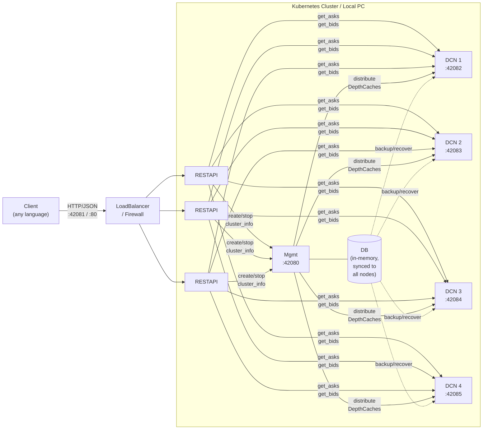

[](https://github.com/oliver-zehentleitner/unicorn-binance-depth-cache-cluster/releases)
[](https://github.com/oliver-zehentleitner/unicorn-binance-depth-cache-cluster/releases)
[](https://oliver-zehentleitner.github.io/unicorn-binance-depth-cache-cluster/license.html)
[](https://codecov.io/gh/oliver-zehentleitner/unicorn-binance-depth-cache-cluster)
[](https://github.com/oliver-zehentleitner/unicorn-binance-depth-cache-cluster/actions/workflows/codeql.yml)
[](https://github.com/oliver-zehentleitner/unicorn-binance-depth-cache-cluster/actions/workflows/unit-tests.yml)
[](https://github.com/oliver-zehentleitner/unicorn-binance-depth-cache-cluster/actions/workflows/build_wheels_ubdcc.yml)
[](https://github.com/oliver-zehentleitner/unicorn-binance-depth-cache-cluster/actions/workflows/build_wheels_ubdcc_dcn.yml)
[](https://github.com/oliver-zehentleitner/unicorn-binance-depth-cache-cluster/actions/workflows/build_wheels_ubdcc_mgmt.yml)
[](https://github.com/oliver-zehentleitner/unicorn-binance-depth-cache-cluster/actions/workflows/build_wheels_ubdcc_restapi.yml)
[](https://github.com/oliver-zehentleitner/unicorn-binance-depth-cache-cluster/actions/workflows/build_wheels_ubdcc_shared_modules.yml)
[](https://oliver-zehentleitner.github.io/unicorn-binance-depth-cache-cluster)
[](https://github.com/oliver-zehentleitner/unicorn-binance-depth-cache-cluster)
[](https://t.me/unicorndevs)

# UNICORN Binance DepthCache Cluster (UBDCC)

Manage hundreds of Binance order book depth caches and access them via REST API — from any programming language, 
any number of clients, with load balancing and automatic failover. Simple to set up: `pip install`, start three 
processes, done.

Built on [UNICORN Binance Local Depth Cache (UBLDC)](https://github.com/oliver-zehentleitner/unicorn-binance-local-depth-cache). 
Part of the [UNICORN Binance Suite](https://github.com/oliver-zehentleitner/unicorn-binance-suite).

## What is UBDCC?

UBDCC turns Binance DepthCaches into a service. Instead of managing WebSocket connections and order book 
synchronization inside your trading bot, you run UBDCC as a standalone system and query it over HTTP whenever you need 
order book data.

It works in two ways:

- **On a single machine** — run a few processes locally and share DepthCache data between multiple bots or scripts 
on the same PC. No Kubernetes needed.
- **On a Kubernetes cluster** — scale across multiple servers with redundancy, multiple public IPs for higher Binance 
API throughput, and automatic state recovery if pods restart.

## Architecture

The system consists of three components:
- **mgmt** (1x) — manages the cluster state and distributes DepthCaches across nodes
- **restapi** (1-3x) — REST API gateway, load-balances data requests to DCN processes
- **dcn** (multiple) — runs the actual DepthCaches via UBLDC

Each DCN runs a single Python process, so **one DCN per CPU core** gives the best performance (Python's GIL limits 
each process to one core).

| Setup | Example configuration |
|-------|----------------------|
| Local (8-core PC) | 1 mgmt, 1 restapi, 6 DCN processes |
| Kubernetes (2 servers, 4 cores each) | 1 mgmt, 3 restapi, 4 DCN pods |

When you create DepthCaches (e.g. 200 markets with `desired_quantity=2`), UBDCC distributes them evenly across DCN 
processes. Each DCN downloads order book snapshots using its own network connection. Replicas are created for 
redundancy — if one DCN goes down, the other copy keeps serving data.



## Key Features

- **Fast access**: Order book data in ~3ms (cluster-internal) or ~4ms total request time on local networks. Over the 
internet typically ~60ms. All requests are load-balanced with automatic failover across redundant DepthCache copies.
- **Any language**: Retrieve DepthCache data via HTTP/JSON from any programming language. Python users can use the 
[UBLDC cluster module](https://oliver-zehentleitner.github.io/unicorn-binance-local-depth-cache/unicorn_binance_local_depth_cache.html#module-unicorn_binance_local_depth_cache.cluster) 
for sync and async access.
- **Flexible filtering**: Trim data at the cluster level — limit to top N Asks/Bids or filter by volume threshold. 
No need to transfer the full order book when you only need the best prices.
- **Fully async top to bottom**: Optimized for fast processing of concurrent requests. The entire stack is built on 
asyncio — from the REST API down to the WebSocket connections. DepthCache management runs directly as a plugin inside 
the [UBWA](https://github.com/oliver-zehentleitner/unicorn-binance-websocket-api) WebSocket event loop, so order book updates are processed with zero overhead. Cluster management, data queries 
and node communication all run non-blocking, keeping response times consistent even when many clients query 
simultaneously.
- **Scales with your resources**: Tested with hundreds of redundant DepthCaches across multiple nodes. Add more 
servers and DCN pods to scale further — there is no hard limit.
- **Compiled C-Extensions**: The entire cluster runs as Cython-compiled code for maximum performance.
- **Smart rate limiting**: Automatically throttles initialization when Binance API weight costs get too high.
- **Self-healing state**: The cluster database is replicated to every node on each sync cycle. If the management pod 
restarts, it automatically recovers the latest state from the node with the most recent backup — no external database 
(Redis, etcd) required, zero manual intervention.
- **Full transparency**: Every request can include `debug=true` to get detailed timing breakdowns 
(cluster execution time, transmission time, total request time), the internal routing URL, and which pods handled the 
request.
- **Supported exchanges**:

| Exchange                                                           | Exchange string               | 
|--------------------------------------------------------------------|-------------------------------| 
| [Binance](https://www.binance.com)                                 | `binance.com`                 |
| [Binance Testnet](https://testnet.binance.vision/)                 | `binance.com-testnet`         |
| [Binance USD-M Futures](https://www.binance.com)                   | `binance.com-futures`         |
| [Binance USD-M Futures Testnet](https://testnet.binancefuture.com) | `binance.com-futures-testnet` |
| [Binance US](https://www.binance.us/)                              | `binance.us`                  |
| [Binance TR](https://www.trbinance.com)                            | `trbinance.com`               |

If you like the project, please 
[](https://github.com/oliver-zehentleitner/unicorn-binance-depth-cache-cluster/stargazers) it on 
[GitHub](https://github.com/oliver-zehentleitner/unicorn-binance-depth-cache-cluster)! 

## Local Setup (without Kubernetes)

Run UBDCC on a single machine — useful for development or when you need multiple bots to share the same 
DepthCache data without duplicate WebSocket connections.

### Install

```bash
pip install ubdcc
```

This installs all components (mgmt, restapi, dcn) and the `ubdcc` cluster manager.

### Start with the cluster manager

```bash
ubdcc start --dcn 4
```

This starts 1 mgmt + 1 restapi + 4 DCN processes and drops you into an interactive console:

```
UBDCC Cluster Manager v0.2.0
Starting cluster with mgmt port 42080, 4 DCN(s)...
  mgmt started (PID 12345)
  restapi started (PID 12346)
  dcn-1 started (PID 12347)
  dcn-2 started (PID 12348)
  dcn-3 started (PID 12349)
  dcn-4 started (PID 12350)

Waiting for 5 pods to register with mgmt...
Cluster is ready!

ROLE             NAME                 PORT     STATUS     VERSION
----------------------------------------------------------------------
ubdcc-mgmt       ubdcc-mgmt           42080    running    0.2.0
ubdcc-restapi    TDMKiCnT6jZ39N       42081    running    0.2.0
ubdcc-dcn        g3HcyluSZ5qWarm      42082    running    0.2.0
ubdcc-dcn        gpU3hkiU9Ei          42083    running    0.2.0
ubdcc-dcn        tDuu9mOXrt445XU      42084    running    0.2.0
ubdcc-dcn        xg6RZRf1APErfh1      42085    running    0.2.0

DepthCaches: 0
Version: 0.2.0

REST API: http://127.0.0.1:42081/
Cluster info: http://127.0.0.1:42081/get_cluster_info

Type 'help' for available commands, Ctrl+C or 'stop' to shut down.

ubdcc>
```

### Interactive console commands

| Command | Description |
|---------|-------------|
| `status` | Show all pods with role, name, port, status and version |
| `add-dcn [count]` | Spawn new DCN process(es) for dynamic scaling |
| `remove-dcn <count\|name>` | Stop and remove DCN(s) — by count or by name |
| `restart <name>` | Restart a specific pod (mgmt, restapi or DCN by name) |
| `stop` | Graceful shutdown of the entire cluster |
| `help` | Show available commands |

### CLI commands (from a separate terminal)

While the cluster is running, you can also manage it from another terminal:

```bash
ubdcc status                     # show cluster status
ubdcc stop                       # shut down the cluster
ubdcc restart g3HcyluSZ5qWarm   # restart a specific pod
```

The CLI automatically remembers the mgmt port. If you started with a custom port (`ubdcc start --port 42090`), 
`status` and `stop` will use it automatically.

### Start manually (without cluster manager)

If you prefer to manage processes yourself, start each component in a separate terminal:

```bash
# Terminal 1: Management (internal, port 42080)
python -c "import os; from ubdcc_mgmt.Mgmt import Mgmt; Mgmt(cwd=os.getcwd())"

# Terminal 2: REST API (your access point, port 42081)
python -c "import os; from ubdcc_restapi.RestApi import RestApi; RestApi(cwd=os.getcwd())"

# Terminal 3+: DepthCacheNode (start one per CPU core you want to use)
python -c "import os; from ubdcc_dcn.DepthCacheNode import DepthCacheNode; DepthCacheNode(cwd=os.getcwd())"
```

### Ports

| Component | Default port | Purpose |
|-----------|-------------|---------|
| mgmt | 42080 | Internal cluster management (not for direct use) |
| restapi | 42081 | **Your access point** — all queries go here |
| dcn | 42082+ | Internal, auto-increments if multiple DCNs run on the same host |

### Good to know

- **Start order does not matter**: All components automatically discover each other and reconnect if any process 
restarts.
- **DCN ports auto-increment**: When you start multiple DCN processes on the same machine, each one automatically 
finds the next free port (42082, 42083, 42084, ...). No manual configuration needed.
- **DepthCaches need a moment**: After creating a DepthCache, it needs a few seconds to download the initial order 
book snapshot from Binance before it can serve data. The status changes from `starting` to `running`.
- **Initialization is sequential**: DepthCaches are initialized one by one to stay within Binance API rate limits. 
This is slower at startup but ensures stable operation. With redundancy (`desired_quantity > 1`), the delay is not 
noticeable in production because at least one copy is always running.

## REST API

The REST API (default port **42081** locally, port **80** on Kubernetes) is your single access point to the cluster. 
On Kubernetes, a LoadBalancer service distributes requests across restapi pods automatically. Locally, you connect 
directly to one restapi instance — it handles all routing to mgmt and DCN processes internally.

### Public Endpoints (restapi)

These are the endpoints you use to interact with the cluster. All requests go through the restapi.

| Endpoint | Method | Parameters | Description |
|----------|--------|------------|-------------|
| `/create_depthcache` | GET | `exchange`, `market`, `desired_quantity`, `update_interval`, `refresh_interval` | Create a single DepthCache |
| `/create_depthcaches` | POST/GET | `exchange`, `markets`, `desired_quantity`, `update_interval`, `refresh_interval` | Create multiple DepthCaches (POST: JSON body, GET: comma-separated markets) |
| `/get_asks` | GET | `exchange`, `market`, `limit_count`, `threshold_volume` | Get ask side of the order book |
| `/get_bids` | GET | `exchange`, `market`, `limit_count`, `threshold_volume` | Get bid side of the order book |
| `/get_cluster_info` | GET | — | Cluster overview: registered pods, versions, DB state |
| `/get_depthcache_list` | GET | — | List all DepthCaches with status and distribution |
| `/get_depthcache_info` | GET | `exchange`, `market` | Detailed info for a specific DepthCache |
| `/stop_depthcache` | GET | `exchange`, `market` | Stop and remove a DepthCache |

All public endpoints accept `debug=true` as an additional parameter for timing and routing details.

### Internal Endpoints (cluster communication)

These endpoints are used by the cluster components to communicate with each other. You don't call these directly, but 
understanding them helps when debugging or extending the system.

**mgmt** (port 42080):

| Endpoint | Method | Description |
|----------|--------|-------------|
| `/ubdcc_node_registration` | GET | DCN/restapi registers itself with mgmt on startup |
| `/ubdcc_node_cancellation` | GET | DCN/restapi deregisters on shutdown |
| `/ubdcc_node_sync` | GET | Periodic heartbeat — DCN/restapi reports status, mgmt pushes DB backup back |
| `/ubdcc_get_responsible_dcn_addresses` | GET | Returns which DCN holds a specific DepthCache (used by restapi for routing) |
| `/ubdcc_update_depthcache_distribution` | GET | DCN reports DepthCache status changes (starting, running) |

**All pods** (shared base):

| Endpoint | Method | Description |
|----------|--------|-------------|
| `/test` | GET | Health check — returns pod info, version, status |
| `/ubdcc_mgmt_backup` | GET/POST | GET: return stored DB backup; POST: receive DB backup from mgmt |

**DCN** (port 42082+):

| Endpoint | Method | Description |
|----------|--------|-------------|
| `/get_asks` | GET | Direct ask query on this DCN (called by restapi after routing) |
| `/get_bids` | GET | Direct bid query on this DCN (called by restapi after routing) |

### Examples

#### Create DepthCaches

```bash
# Create multiple DepthCaches (POST with JSON body)
curl -X POST 'http://127.0.0.1:42081/create_depthcaches' \
  -H 'Content-Type: application/json' \
  -d '{"exchange": "binance.com", "markets": ["BTCUSDT", "ETHUSDT", "BNBUSDT"], "desired_quantity": 2}'

# Create a single DepthCache (GET)
curl 'http://127.0.0.1:42081/create_depthcache?exchange=binance.com&market=BTCUSDT&desired_quantity=2'

# Create multiple via GET (useful for browser testing, comma-separated markets)
curl 'http://127.0.0.1:42081/create_depthcaches?exchange=binance.com&markets=BTCUSDT,ETHUSDT&desired_quantity=1'
```

#### Query order book data

```bash
# Get top 3 asks
curl 'http://127.0.0.1:42081/get_asks?exchange=binance.com&market=BTCUSDT&limit_count=3'

# Get bids filtered by volume threshold
curl 'http://127.0.0.1:42081/get_bids?exchange=binance.com&market=ETHUSDT&threshold_volume=100000'
```

#### Manage and monitor

```bash
# List all DepthCaches and their status
curl 'http://127.0.0.1:42081/get_depthcache_list'

# Get detailed info for a specific DepthCache
curl 'http://127.0.0.1:42081/get_depthcache_info?exchange=binance.com&market=BTCUSDT'

# Cluster overview (registered pods, versions, timestamps)
curl 'http://127.0.0.1:42081/get_cluster_info'

# Stop a DepthCache
curl 'http://127.0.0.1:42081/stop_depthcache?exchange=binance.com&market=BTCUSDT'
```

#### Debugging

Add `debug=true` to any request to get timing and routing details:

```bash
curl 'http://127.0.0.1:42081/get_asks?exchange=binance.com&market=BTCUSDT&limit_count=2&debug=true'
```

The response includes a `debug` block with:
- `cluster_execution_time` — time spent processing the request inside the cluster
- `transmission_time` — network overhead between restapi and DCN
- `request_time` — total round-trip time (filled by the UBLDC Python client)
- `url` — the internal URL that was routed to
- `post_body` — the POST body (for POST requests)
- `used_pods` — which pods handled this request

## Kubernetes Setup

- Get a Kubernetes cluster with powerful CPUs from a provider of your choice and connect `kubectl`
- Install dependencies

```
kubectl apply -f https://github.com/kubernetes-sigs/metrics-server/releases/latest/download/components.yaml
```

### Helm Chart
- [Install Helm](https://helm.sh/docs/intro/install) 
- Prepare `helm`

``` 
helm repo add ubdcc https://oliver-zehentleitner.github.io/unicorn-binance-depth-cache-cluster/helm
helm repo update
```

- Install the UNICORN Binance DepthCache Cluster

``` 
helm install ubdcc ubdcc/ubdcc
```

- Get the "LoadBalancer Ingress" IP, the default Port is TCP 80!

```
kubectl describe services ubdcc-restapi
```

#### Choose an explicit version
- Find a version to choose

``` 
helm search repo ubdcc
```

- Then

``` 
helm install ubdcc ubdcc/ubdcc --version 0.2.0
```

#### Choose a namespace
``` 
helm install ubdcc ubdcc/ubdcc --namespace ubdcc
```

#### Choose an alternate public port
``` 
helm install ubdcc ubdcc/ubdcc --set publicPort.restapi=8080
```
  
### Kubernetes Deployment
- [Download the deployment files](https://github.com/oliver-zehentleitner/unicorn-binance-depth-cache-cluster/tree/master/admin/k8s)
- Apply the deployment files with `kubectl`

``` 
kubectl apply -f ./setup/01_namespace_ubdcc.yaml
kubectl apply -f ./setup/02_role_ubdcc.yaml
kubectl apply -f ./setup/03_rolebinding_ubdcc.yaml
kubectl apply -f ./ubdcc-dcn.yaml  
kubectl apply -f ./ubdcc-mgmt.yaml
kubectl apply -f ./ubdcc-mgmt_service.yaml
kubectl apply -f ./ubdcc-restapi.yaml
kubectl apply -f ./ubdcc-restapi_service.yaml
```

- Get the "LoadBalancer Ingress" IP, the default Port is TCP 80:

```
kubectl describe services ubdcc-restapi
```

## Security
In any case, you should set the firewall in the web interface of the Kubernetes provider so that only your systems 
have access to UBDCC.

If you want to do this, you can add HTTPS to the LoadBalancer with most providers.
  
## Uninstallation
```
kubectl delete -f https://github.com/kubernetes-sigs/metrics-server/releases/latest/download/components.yaml
```

### Helm Chart
```
helm uninstall ubdcc
```

### Kubernetes Deployment
- Delete the deployment with `kubectl`

``` 
kubectl delete -f ./setup/01_namespace_ubdcc.yaml
kubectl delete -f ./setup/02_role_ubdcc.yaml
kubectl delete -f ./setup/03_rolebinding_ubdcc.yaml
kubectl delete -f ./ubdcc-dcn.yaml  
kubectl delete -f ./ubdcc-mgmt.yaml
kubectl delete -f ./ubdcc-mgmt_service.yaml
kubectl delete -f ./ubdcc-restapi.yaml
kubectl delete -f ./ubdcc-restapi_service.yaml
```

## Accessing from Python

While the REST API can be used from any language, Python users can use the 
[UBLDC cluster module](https://github.com/oliver-zehentleitner/unicorn-binance-local-depth-cache?tab=readme-ov-file#connect-to-a-unicorn-binance-depth-cache-cluster) 
for a native experience with sync and async support, automatic connection handling, and `debug=True` output.

See the [examples](https://github.com/oliver-zehentleitner/unicorn-binance-local-depth-cache/tree/master/examples/unicorn_binance_depth_cache_cluster).

## How to report Bugs or suggest Improvements?
[List of planned features](https://github.com/oliver-zehentleitner/unicorn-binance-depth-cache-cluster/issues?q=is%3Aissue+is%3Aopen+label%3Aenhancement) - click  if you need one of them or suggest a new feature!

Before you report a bug, [try the latest release](https://github.com/oliver-zehentleitner/unicorn-binance-depth-cache-cluster#installation-and-upgrade). If the issue still exists, provide the error trace, OS 
and Python version and explain how to reproduce the error. A demo script is appreciated.

If you don't find an issue related to your topic, please open a new [issue](https://github.com/oliver-zehentleitner/unicorn-binance-depth-cache-cluster/issues)!

[Report a security bug!](https://github.com/oliver-zehentleitner/unicorn-binance-depth-cache-cluster/security/policy)

## Contributing
[UNICORN Binance DepthCache Cluster](https://github.com/oliver-zehentleitner/unicorn-binance-depth-cache-cluster) is an open 
source project which welcomes contributions which can be anything from simple documentation fixes and reporting dead links to new features. To 
contribute follow 
[this guide](https://github.com/oliver-zehentleitner/unicorn-binance-depth-cache-cluster/blob/master/CONTRIBUTING.md).
 
### Contributors
[](https://github.com/oliver-zehentleitner/unicorn-binance-depth-cache-cluster/graphs/contributors)

We  open source!

## Disclaimer
This project is for informational purposes only. You should not construe this information or any other material as 
legal, tax, investment, financial or other advice. Nothing contained herein constitutes a solicitation, recommendation, 
endorsement or offer by us or any third party provider to buy or sell any securities or other financial instruments in 
this or any other jurisdiction in which such solicitation or offer would be unlawful under the securities laws of such 
jurisdiction.

### If you intend to use real money, use it at your own risk!

Under no circumstances will we be responsible or liable for any claims, damages, losses, expenses, costs or liabilities 
of any kind, including but not limited to direct or indirect damages for loss of profits.
